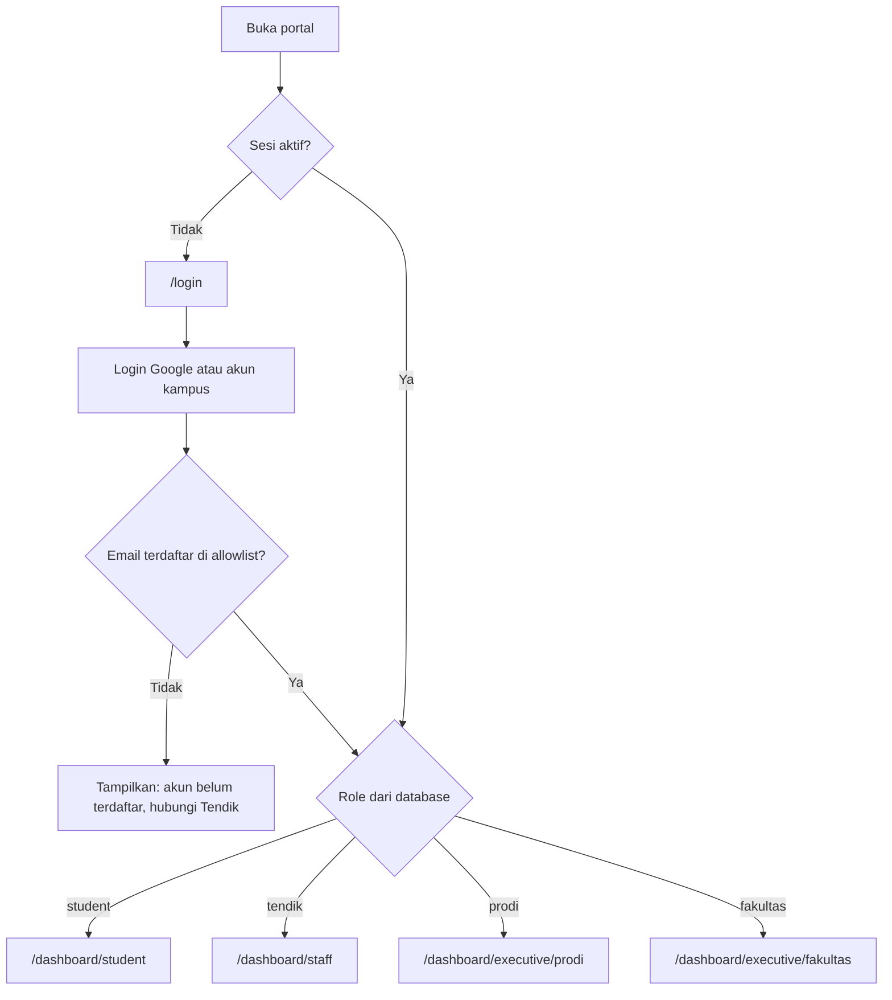
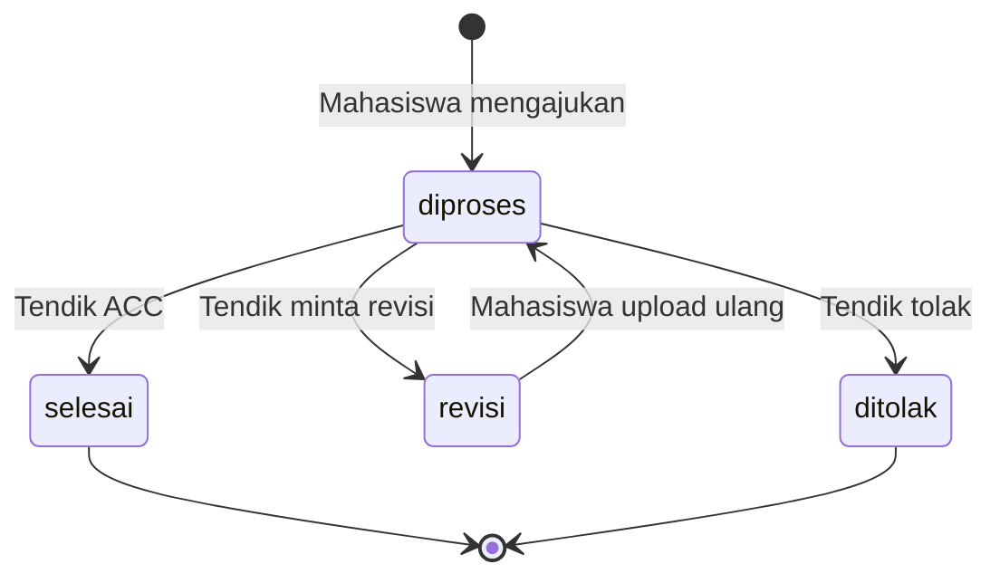
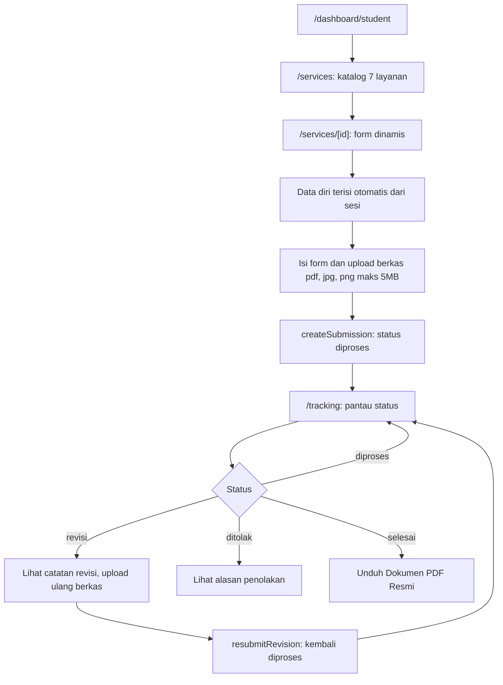
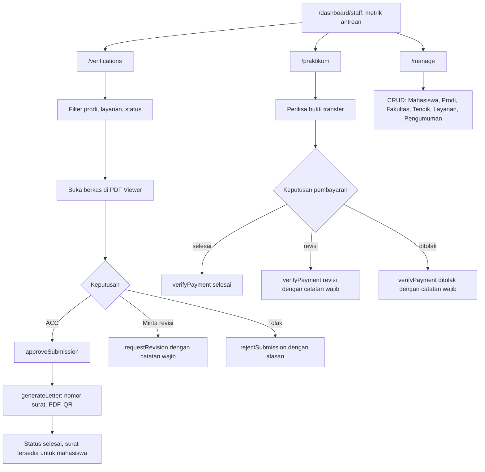
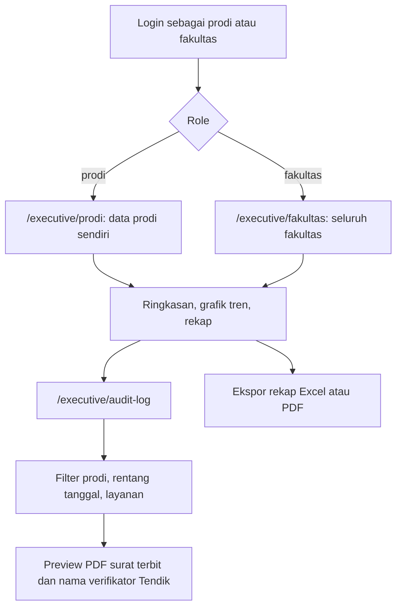
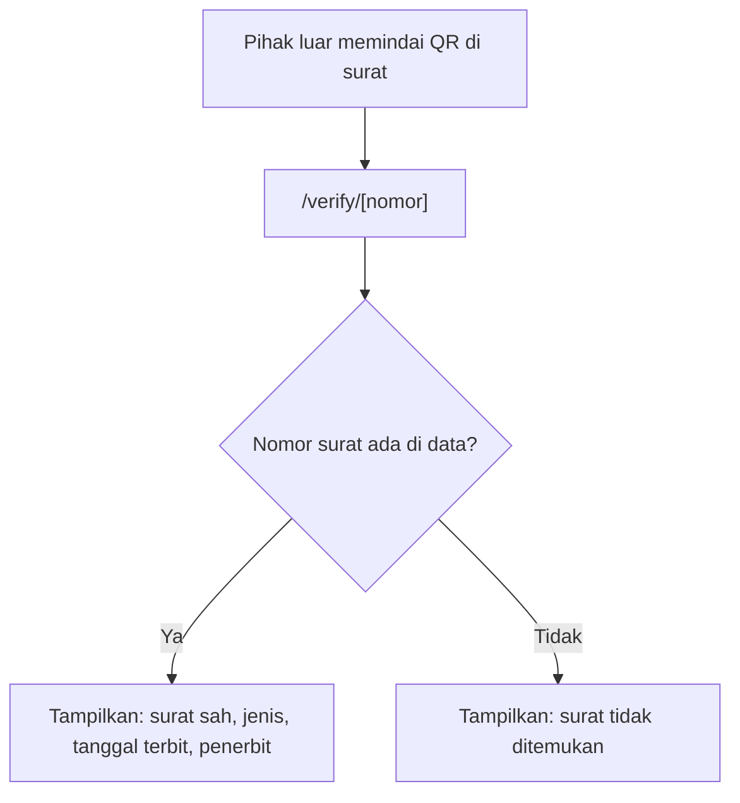

# Alur Pengguna dan Arsitektur Navigasi

Dokumen ini menjelaskan alur kerja tiap role, status pengajuan, dan peta navigasi. Diagram memakai Mermaid (tampil otomatis di GitHub dan VS Code dengan ekstensi Mermaid).

## 1. Alur login dan redirect

Catatan: pada tahap prototipe, login memakai mock dengan Role Switcher Demo. Role Switcher wajib dimatikan di production.

## 2. Status pengajuan layanan

Aturan transisi yang ditegakkan di `src/lib/services/submissions.ts`:

| Fungsi | Status awal yang valid | Status hasil |
|---|---|---|
| `createSubmission` | (baru) | `diproses` |
| `approveSubmission` | `diproses` | `selesai` |
| `requestRevision` | `diproses` | `revisi` |
| `rejectSubmission` | `diproses` | `ditolak` |
| `resubmitRevision` | `revisi` | `diproses` |

## 3. Alur mahasiswa: dari pengajuan sampai unduh surat

Alur pembayaran praktikum:

```mermaid
flowchart TD
    A["/praktikum"] --> B["Isi mata kuliah dan nominal"]
    B --> C["Upload bukti transfer"]
    C --> D["createPayment: status diproses"]
    D --> E["/tracking: pantau status pembayaran"]
    E --> F{"Status"}
    F -- revisi --> G["Upload ulang bukti: resubmitPayment"]
    G --> E
    F -- selesai --> H["Kepesertaan praktikum disetujui"]
    F -- ditolak --> I["Lihat alasan penolakan"]
```

## 4. Alur Tendik (satu-satunya eksekutor)

## 5. Alur monitoring executive (read-only)

Aturan: Prodi dan Fakultas tidak memiliki tombol ACC, Revisi, atau Tolak. Data Kaprodi dibatasi pada prodinya sendiri (aturan ini belum diimplementasikan, tugas A2).

## 6. Verifikasi surat lewat QR (publik, tanpa login)

Route `/verify/*` wajib dikecualikan dari proteksi login di `src/proxy.ts`.

## 7. Matriks akses rute

| Rute | student | tendik | prodi | fakultas | Publik |
|---|---|---|---|---|---|
| `/login` | ya | ya | ya | ya | ya |
| `/verify/[nomor]` | ya | ya | ya | ya | ya |
| `/dashboard/student/*` | ya | tidak | tidak | tidak | tidak |
| `/dashboard/staff/*` | tidak | ya | tidak | tidak | tidak |
| `/dashboard/executive/prodi` | tidak | tidak | ya | tidak | tidak |
| `/dashboard/executive/fakultas` | tidak | tidak | tidak | ya | tidak |
| `/dashboard/executive` dan `/audit-log` | tidak | tidak | ya | ya | tidak |

Pengguna yang membuka rute di luar haknya dialihkan ke dashboard role masing-masing.

## 8. Navigasi sidebar per role

| Role | Menu |
|---|---|
| student | Beranda, Layanan Akademik, Pembayaran Praktikum, Status dan Riwayat |
| tendik | Beranda, Verifikasi Surat, Verifikasi Praktikum, Kelola Data |
| prodi | Ringkasan Prodi, Audit Log |
| fakultas | Ringkasan Fakultas, Audit Log |

Semua role memiliki topbar berisi logo, judul portal, tombol notifikasi, dan menu profil (Logout).

## 9. Keadaan halaman yang wajib ada

Setiap halaman yang mengambil data wajib menangani tiga keadaan:

| Keadaan | Tampilan |
|---|---|
| Memuat | Skeleton loading |
| Kosong | Komponen empty state dengan ajakan tindakan |
| Gagal | Pesan error dan tombol coba lagi |
